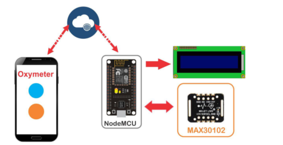

# Digital Pulse Oximeter with IoT Monitoring

A comprehensive IoT pulse oximeter system built with ESP8266 NodeMCU and MAX30100/MAX30102 sensors to measure heart rate (BPM) and blood oxygen saturation (SpO₂). It supports three interface options: an I2C LCD display, the Blynk mobile app for cloud monitoring, and a built-in web server dashboard over Wi-Fi.

## Table of Content

* [Features](#features)
* [What is IoT?](#what-is-iot)
* [Hardware Requirements](#hardware-requirements)
* [Software Requirements](#software-requirements)
* [Getting Started](#getting-started)
* [Three Implementation Options](#three-implementation-options)
* [Hardware Connections](#hardware-connections)
* [Installation Guide](#installation-guide)
* [Troubleshooting](#troubleshooting)
* [Contributing](#contributing)

## Features

* Real-time Monitoring: Continuous heart rate and SpO2 measurement
* LCD Display: 16x2 12C LCD for local data visualization
* loT Connectivity: Remote monitoring via Blynk mobile app
* Cloud Integration: Data logging and historical tracking
* Beat Detection: Visual/audio feedback on heartbeat detection
* Automatic Calibration: Self-calibrating sensor readings
* Low Power: Optimized for extended operation

## What is IoT?
Internet of Things (IoT) connects physical devices to the internet, enabling remote
monitoring and control. In this project:

Traditional Oximeter: You must be physically present to read values

IoT Oximeter: You can:

* Monitor readings from anywhere with internet
* Receive alerts on your smartphone
* Track historical data in the cloud
* Access from multiple devices simultaneously

IoT System Components

1. Hardware/Things: Sensors (MAX30100) and actuators
2. Internet: WiFi connectivity via ESP8266
3. Cloud/Server: Blynk servers or local web server
4. Application: Mobile app or web browser interface

## Hardware Requirements
|Component|Specification|Quantity|Purpose|
|-|-|-|-|
|NodeMCU V3|ESP8266 ESP-12E|1|Main controller with WiFi|
|MAX30100/30102|Pulse oximeter sensor|1|Measure BPM & SpO2|
|LCD 16x2|With I2C module|1|Local display|
|I2C Module|PCF8574|1|LCD interface adapter|
|Breadboard|Standard|1|Prototype connections|
|Jumper Wires|M-M,M-F|10-15|Connections|
|USB Cable|Micro USB|1|Programming & power|

NodeMCU V3 ESP8266 Specifications

* Microcontroller: Tensilica 32-bit RISC CPU
* Flash Memory: 4MB
* Operating Voltage: 3.3V
* Input Voltage: 7-12V (VIN) or 5V (USB)
* Digital I/O Pins: 16
* Analog Input: 1 (10-bit ADC)
* Communication: UART, SPI, I2C
* WiFi: 802.11 b/g/n (2.4GHz)
* Current: 80mA average

MAX30100/30102 Sensor Specifications
* Operating Voltage: 1.8V - 3.3V
*  LED Supply: 3.3V internal
* nterface: I2C
* Dimensions: 19.6 x 15.56 mm
* Operating Temperature: -40C to +85°C
* Measurements: SpO2 & Heart Rate

Pin Configuration:

* VIN: Power input (1.8V -3.3V)
* SCL: I2C Clock
* SDA: I2C Data
* GND: Ground

LCD 16x2 with I2C Module

* Display: 16 columns x 2 rows
* Interface: I2C (only 4 wires needed!)
* I2C Address: 0x27 or 0x3F (configurable)
* Operating Voltage: 5V
* Backlight: Adjustable via potentiometer

## Software Requirements

### Development Tools
* **Arduino IDE v1.8.13 or higher**
    * **Download**: [https://www.arduino.cc/en/software](https://www.arduino.cc/en/software)
* **ESP8266 Board Package v2.7.4 or higher**
    * Added via **Board Manager**
* **CH340G USB Driver** (if not auto-detected)
    * For **NodeMCU USB communication**

### Required Libraries
All libraries included in `/libraries` folder:

1. **MAX30100lib** - Pulse oximeter sensor library
2. **LiquidCrystal_I2C** - I2C LCD display library
3. **Blynk Library** - IoT platform (for **Option 2**)
4. **ESP8266WiFi** - WiFi connectivity (built-in)
5. **ESP8266WebServer** - Web server (built-in)

### Mobile Application (Optional)
For **Blynk IoT implementation**:

* **Blynk IoT app**
    * [Android Download](https://play.google.com/store/apps/details?id=cloud.blynk)
    * [iOS Download](https://apps.apple.com/us/app/blynk-iot/id1559317868)

## Getting Started

### Quick Start Guide

### 1. Hardware Assembly (15 minutes)
* Connect MAX30100 sensor to NodeMCU
* Connect I2C LCD to NodeMCU
* Verify all connections

### 2. Software Setup (20 minutes)
* Install Arduino IDE
* Add ESP8266 board support
* Install required libraries

### 3. Choose Implementation (Select one):
* **Option 1: LCD Only** (Simplest)
* **Option 2: Blynk IoT** (Remote monitoring)
* **Option 3: Web Server** (Browser access)

### 4. Upload & Test
* Configure WiFi settings (if using IoT)
* Upload code to NodeMCU
* Test functionality

**Detailed Setup → See [INSTALLATION.md](INSTALLATION.md)**

## Three Implementation Options
### Option 1: LCD Display Only
**Perfect for**: Standalone portable oximeter

**What you get**:
* Real-time readings on LCD screen
* No internet required
* Battery-friendly operation
* Instant measurements

**Ideal use**: Personal use, medical clinics, field work
📖 **Guide**: `docs/OPTION1_LCD.md`

### Option 2: IoT with Blynk Mobile App
**Perfect for**: Remote patient monitoring

**What you get**:
* Monitor from anywhere via smartphone
* Beautiful gauge displays
* Historical data tracking
* Mobile push notifications
* Multi-device support

**Ideal use**: Telemedicine, elderly care, remote health monitoring
📖 **Guide**: `docs/OPTION2_BLYNK.md`

### Option 3: Web Server Interface
**Perfect for**: Professional multi-user systems

**What you get**:
* Access from any web browser
* No app installation needed
* Professional interface
* Auto-refresh display
* Multiple simultaneous users

**Ideal use**: Hospital monitoring, medical facilities, web-based systems
📖 **Guide**: `docs/OPTION3_WEBSERVER.md`

## Hardware Connections

### Pin Configuration

### MAX30100/30102 → NodeMCU:
---
VIN →  3.3V ⚠️ IMPORTANT: Use 3.3V, NOT 5V!
GND →  GND
SCL →  D1 (GPIO05)
SDA →  D2 (GPIO04)
---
### I2C LCD Module → NodeMCU:
**VCC** →  **5V**
**GND** →  **GND**
**SCL** →  **D1 (GPIO05)**
**SDA** →  **D2 (GPIO04)**
